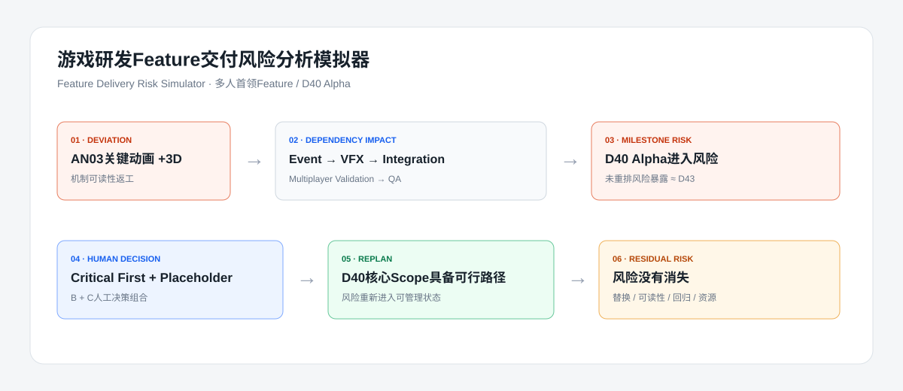

# 游戏研发Feature交付风险分析模拟器

Feature Delivery Risk Simulator｜V1.0 Demo

## 项目简介

这是一个面向游戏研发流程的Feature交付风险分析模拟Demo。用户输入已经发生的研发偏差后，工具会沿Dependency Graph展开影响，判断Milestone风险，展示可选决策，并模拟Replan后的可行交付路径与Residual Risk。

一句话价值：不是预测项目什么时候延期，而是在延期发生后，帮助制作团队快速理解影响、评估方案，并重新找到可交付路径。

## 核心问题

研发任务延期通常会沿依赖链影响下游集成、验证和版本节点。项目用一个固定案例展示制作策划如何完成“发现问题 → 分析影响 → 判断风险 → 制定方案 → 调整计划 → 跟踪剩余风险”的完整闭环。

## 演示流程

1. 项目概览
2. 依赖关系
3. 风险输入
4. 影响分析
5. 决策中心
6. 重排结果

## Demo场景

- Feature：多人首领Feature
- 当前阶段：Alpha
- 目标节点：D40
- 偏差事件：AN03｜Phase 2关键动画因机制可读性返工，预计延期3个工作日
- 决策路径：B 关键动画优先 + C Placeholder临时联调
- 结果口径：D40 Alpha核心Scope重新具备可行交付路径，但替换、可读性、回归窗口和资源竞争风险仍需持续跟踪

## 功能说明

- 固定WBS与Dependency Graph展示
- 研发偏差输入与动态D40 + Delay风险投影
- Direct / Secondary / Milestone影响分析
- 进度、质量、资源、范围四维定性评估
- 五类决策方案与人工勾选
- B + C组合Replan模拟
- Residual Risk及Owner跟踪
- 一键播放完整示例

## 数据说明

任务、Milestone、依赖、决策方案和剩余风险集中配置在 `lib/demo-data.ts`。当前版本采用JSON式Mock数据与固定规则，不依赖数据库或后端服务。

## 研究边界

本项目为个人游戏研发制作管理研究Demo。任务、WBS、排期、依赖、风险与决策均为模拟数据，不代表任何真实公司或项目内部流程。

本项目不是Jira替代品、甘特图工具、通用项目管理软件、AI聊天助手或企业管理平台，也不包含Monte Carlo、完整CPM或真实项目数据。

## 本地运行

环境要求：Node.js 22.13.0或更高版本。

```bash
npm ci
npm run dev
```

浏览器访问终端显示的本地地址。

## 技术栈

- Next.js / React / TypeScript
- 静态Mock数据
- 静态导出，不依赖数据库或后端服务

## 在线Demo

- 正式公网链接：https://1285567522zhou-maker.github.io/feature-delivery-risk-simulator/

## 部署说明

项目通过GitHub Pages公开部署，无需登录或安装软件。推送到`main`分支后，仓库中的`Deploy GitHub Pages`工作流会自动重新发布；也可以在GitHub Actions页面手动运行该工作流。

项目不需要环境变量。静态构建命令为：

```bash
npm install
npm run build:static
```

## Demo重置

在重排结果页点击“重置模拟”，或直接刷新页面，即可恢复默认的AN03延期3个工作日场景。核心Demo数据不会被访问者删除。

## 核心流程截图



## 简历描述

**Feature Delivery Risk Simulator｜游戏研发Feature交付风险分析模拟器**

针对游戏研发Feature交付过程中的延期与依赖风险，设计研发风险分析模拟Demo。通过任务依赖建模，实现研发偏差影响分析、Milestone风险判断、多方案决策和Replan模拟，验证制作管理过程中从问题发现到重新收敛交付的完整流程。

